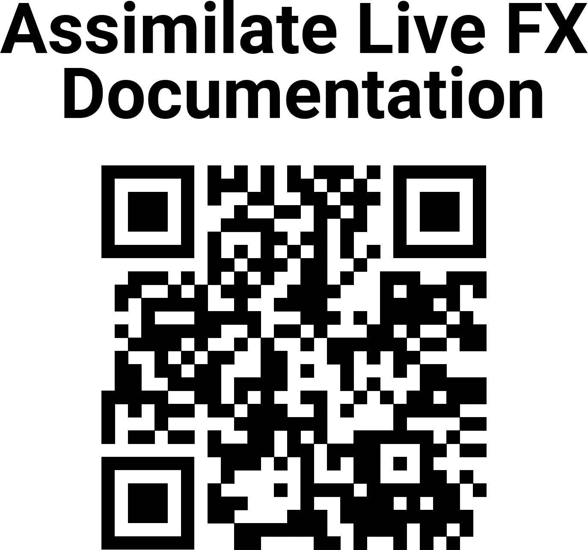

# 📚 Getting Started

**Live FX** is a software media server for virtual production that includes Green Screen and LED wall workflows, for both Windows and Mac operating systems.&#x20;

Some of the main features of Live FX include:

* 16k+ Resolution [**Video Playback**](quickstart-example-projects/simple-video-playback.md)
* [**Unreal Engine**](unreal-engine/)/Unity/Notch compatibility
* Every major Video Codec including ProRes, Notch LC, h.264
* [**Projection-Mapping**](led-workflow/)
* LED Wall mapping
* [**Green Screen**](green-screen-workflow/) compositing
* Image-Based [**Lighting**](lighting/)
* Fast Nodal offset and lens calibration workflows

**Some helpful links:**\
[Visit the Website](https://www.assimilateinc.com/products/livefx/)\
[Register for a free trial of Live FX](https://register.assimilateinc.com/registration.aspx?p=9)\
[Join our Discord community](https://discord.com/invite/dgQepa6qjr)\
[Download the Latest Build](https://www.assimilateinc.com/download/)\
[Email Support](mailto:support@assimilateinc.com)

## Using this documentation

This knowledge base will help you learn all about Live FX.

You can use the sidebar on the left to navigate through the documentation, or you can use the search function to search for specific information.&#x20;

The search shortcut on the computer is Control+K (windows) / Command+K).&#x20;

If you're just discovering Live FX, we recommend jumping straight into the [Quickstart Example Projects](<README (1).md>)!

## QR Code Link

Here are [two QR Codes that link to this documentation](https://www.dropbox.com/scl/fo/ki8otwkk4za5w71sr5jv8/h?rlkey=illcx4k2dm6czrh14gi81i8wv\&dl=0), in case you want to print them up and keep them at your Studio. \
\
\
