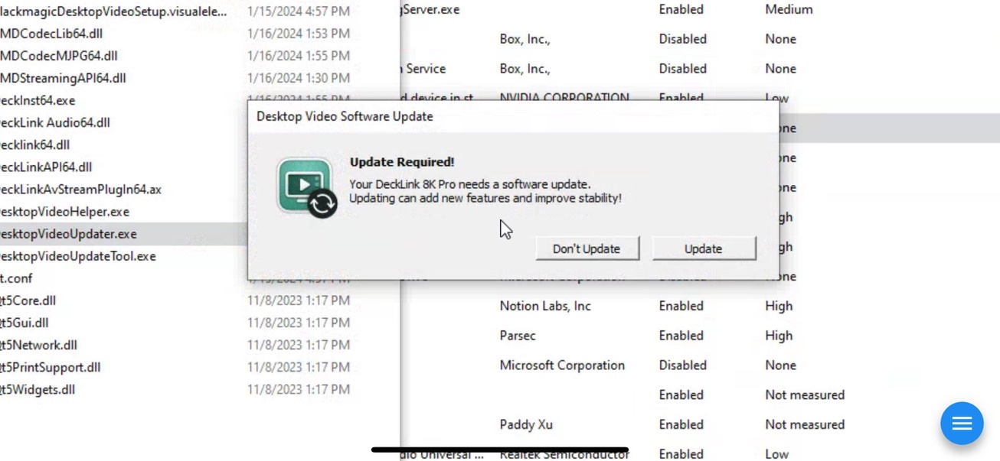

# Black Magic Troubleshooting

## Blackmagic Capture Card doesn't show up in Blackmagic Desktop Video Setup

When you've installed your capture card, but it does not show up when you open Blackmagic Desktop Video Setup app, you can try this to fix your issue.&#x20;

1. **Install** the latest Desktop Video app.&#x20;
2. Navigate to where it is installed, for me that is:\
   C:\Program Files\Blackmagic Design\Blackmagic Desktop Video
3. In that folder, launch **DesktopVideoUpdater.exe**
4.  If it prompts you, update your capture card.\

    <figure><figcaption></figcaption></figure>

5. Restart your computer for the changes to go into effect.
