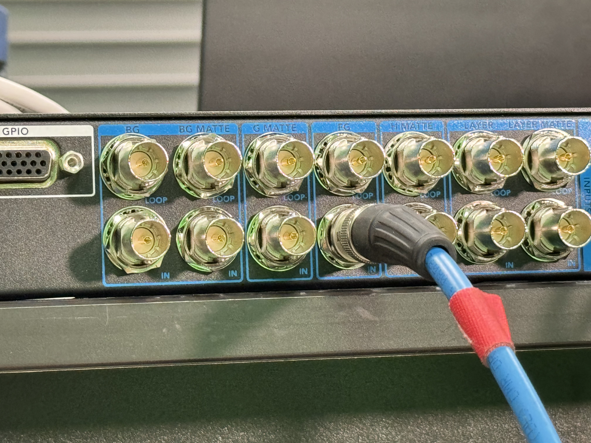
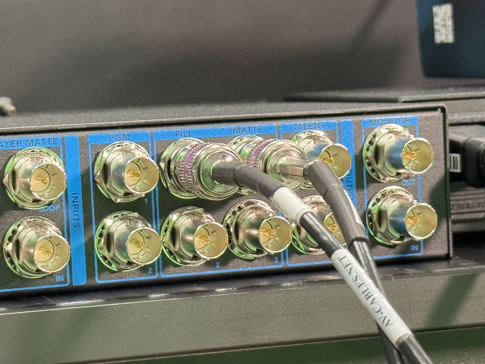

# Working with Ultimatte

The Blackmagic Design Ultimatte is an alternative way to key out your footage.&#x20;

## Setup

1.  Set up the Ultimatte so that it is receiving the camera signal in the FG (Foreground) input.\
    \

    <figure><figcaption></figcaption></figure>

2.  On the Ultimatte, route the outputs from the Fill and Matte bnc connectors.\

    <figure><figcaption></figcaption></figure>

3.  In Live FX, set up your Video IO so that you have two inputs, one for the fill and one for the matte. \
    Make sure you turn your Video IO on, enable the two outputs and press apply. You should be able to see the foreground and matte in the preview after you apply the settings. \

    <figure><figcaption></figcaption></figure>

4.  In the construct, click on Live Setup, use the Basic Capture method, and select the Foreground camera in the Live Capture selection menu. \
    &#x20;

    <figure><figcaption></figcaption></figure>

5.  Repeat the last step but use the Matte in the foreground menu. You can rename it here if you want, or you can rename later.\

    <figure><figcaption></figcaption></figure>

6.  Drag the Matte so that it is on top of your Foreground camera, and then double-click on the foreground camera to enter the shot.\

    <figure><figcaption></figcaption></figure>

7.  With no Layer selected, open the Fill/Matte menu on the bottom left. On the right-side menu, go to the versions tab, click and drag the Matte down to the **Drop Layer Matte** area.\

    <figure><figcaption></figcaption></figure>

8.  Enable the R, G, and B channels on the Matte. **THIS STEP IS VERY IMPORTANT.**\

    <figure><figcaption></figcaption></figure>

9.  Now if you press the A, you should see the alpha matte.\

    <figure><figcaption></figcaption></figure>

10. From the Right-Side menu, click on Node Tree. Then de-select the nodes and **select only the top node.** Then click on **Nest.**\
    \

    <figure><figcaption></figcaption></figure>

## Working with the Matte

Now that you have this pre-comp, you can use this with the alpha channel. Let's test it out.

Right-click, add a color frame and then change it to Color Bars. At first, you with not see the camera feed.&#x20;

To have the matte affect the background, you have to go down to the Fill/Matte menu and press the A, to use the Alpha channel that is now embedded in our clip. \

<figure><figcaption></figcaption></figure>

If you want the layer to only affect the foreground, in the Fill/Matte menu, click on the A for alpha, then click on the I right next to it, to invert the matte. In this example, I've desaturated the foreground camera, without desaturating the background.&#x20;

<figure><figcaption></figcaption></figure>
