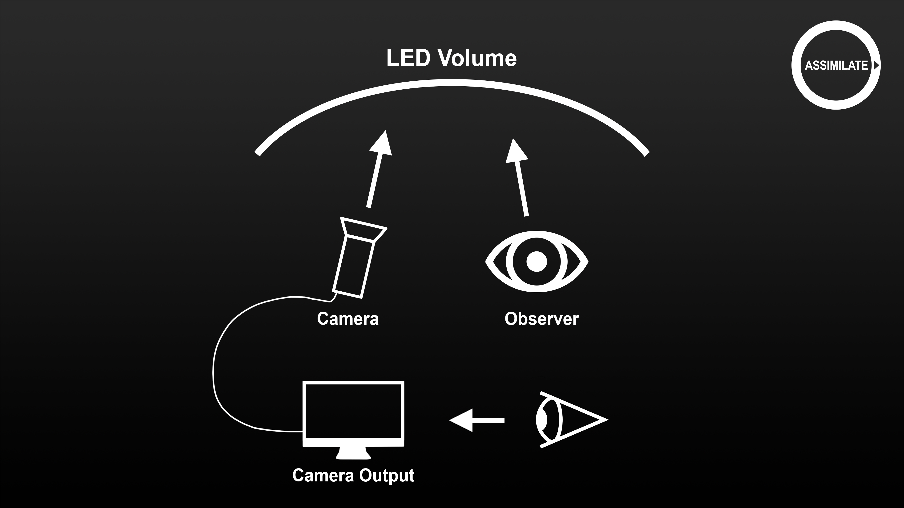
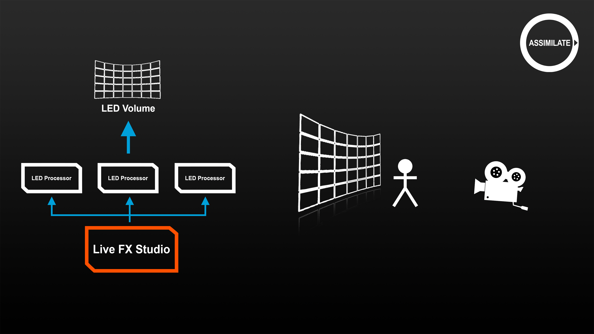

# Part 1: General Introduction to Projection Mapping

Here is the Youtube Video for this part, if you rather watch, than read  ;-) .



***

This is the first part in the series of tutorial videos about LED wall projection using Live FX Studio. In this video we will cover the basic concepts of projection, we’ll introduce you to the Stage Manager in and show the steps for creating a simple projection composition in Live FX Studio.

But before we do that, we first want to go over lesson one in LED wall projection and that is:&#x20;

**DO NOT LOOK AT THE WALL!**

Now obviously we do not mean that literally that you are not to allowed to ever look at the wall. But you do need to realize that what you see on the wall is not the end-result that we are attempting to create. The result that we are after is the camera recording the scene with the wall as background. Most of the time, you are not in the same physical position as the camera when looking at the wall, nor do you change positions in the same way, so your perspective is different. The projection on the wall is generated so that it is correct from the perspective of the camera. This is both in terms of geometry, e.g. in case of a curved wall, as well as in terms of color. If at any time you are confused on what you are seeing on a wall directly, have a look at what the camera is seeing. In fact, first and always look at what the camera is seeing to check your setup.

<figure><figcaption></figcaption></figure>

Now before we start with setting things up in Live FX Studio, let’s first cover some generic aspects of projection and related terminology. In a typical LED wall projection setup, you have a media server providing the content, in this case Live FX Studio, that feeds into one or more LED wall processors which in turn feeds the image into the actual LED wall. In front of the LED wall, we have a camera recording the scene – that is the actors in the foreground with the LED wall background.

<figure><figcaption></figcaption></figure>

To get the best image and smooth playback, all the following elements need to be aligned.&#x20;

\[Framerate]\
\[prevent stuttered playback] The media server and the LED processor need to operate at the same framerate. If not, this can result in stuttering and choppy playback. This also accounts for the framerate of pre-recorded plates that are used for projection. In certain situations, you should consider using re-timer functionality to convert source media to the desired framerate to avoid arbitrary repeating or skipping of frames.&#x20;

\[GenLock]\
\[Sync wall and camera]. In a typical setup the LED processor and the recording camera are genlocked to ensure that the different walls refresh at exactly the same time and the camera records frames in exactly that same rhythm. In this setup it is not necessary to GenLock the media server – in our case Live FX. Not even if Live FX feeds multiple LED processors, either directly out of the GPU or through an SDI connection. If, however you need multiple Live FX systems to control a large volume, you should consider a frame-locking system like the Nvidia Quadro Sync. This ensures not just the sync of refresh moments but also ensures that all systems play the same frame at any moment. This is an absolute necessity when two Live FX systems each control part of the inner frustum. When the multiple systems control different walls which do not overlap then this becomes optional. In a lot of cases a one-frame difference between walls used for the outer frustum reflection is acceptable and does not warrant the extra cost and effort to set up the frame-sync mechanism.

\[Latency]\
\[Delayed responses] Each element in the projection setup adds some amount of delay to the signal from source to actual display on the wall. This might appear in the image on the wall appearing to react delayed to any camera motion. You should be aware of latency caused by the various elements and investigate delays that lie out of the expected amount of latency.

\[Resolution]\
\[prevent unsharp image] In a lot of cases will the LED wall pixel resolution not exactly match the resolution of the source media, nor will it match the resolution of the signal that is sent from the media server to the LED processor. Although a certain amount of remapping and scaling is unavoidable, implicit scaling should be prevented as it can lead to a soft and unsharp image. When scaling is required, ensure that a proper high order filter is used to preserve the image quality as much as possible.

\[Colorspace]\
\[prevent unexpected color output]\[full grading toolset to create the final pixel]\[Color calibration] The media server and the LED wall processors operate in a certain color space, which are not necessarily the same. You need to be able to fully manage the image pipeline and apply the correct color transforms where needed to prevent unexpected color output on the LED wall. Next to the technical colorspace and transfer curve adjustments, you require a full grading toolset to adjust the image in any way needed while on-set and be able to deliver the final pixel quality the director requires.

Also related to this is calibrating the LED wall to the specific camera that is being used. This is a topic for a separate tutorial.

\[Frustum]\
\[Inner- and Outer-frustum. Manage independently]\[Set-extension]. The inner frustum is the part of the LED wall that the camera that is recording the scene is actually viewing. The outer frustum is everything on the wall outside the inner frustum. You should be able to manage each part independently. Even though the outer frustum is not seen by the camera, it is a light source that affects the light reflections on your scene. In some cases, it is a welcome extra light source to your stage lights, in other cases a light source that needs to be dimmed as it gets in the way of your stage lights.

In case your camera has a wider view angle than the LED wall covers, you are recording outside of the wall. Usually, you want to avoid this but in some cases the size of the wall cannot cover the desired field of view and adding more wall is not easily achieved. This is not necessarily a problem, but it does mean that you do need to process the scene in post-production to extend the content of the wall. To pre-visualize the final shot on-set, you can create a so-called virtual set-extension where you capture the live feed from the camera and filter out the part where the LED wall ends and add the background content, similar to what you do in a green-screen context. You use the same media that you projected on the LED wall but now use it with a mask that is generated based on the position of the camera and the LED wall. The process for creating a set-extension with Live FX Studio is discussed in detail later in this tutorial series.

On the Assimilate Support website there is a [**checklist** ](https://www.assimilatesupport.com/akb/KnowledgebaseArticle51054.aspx)available that covers possible issues with the various aspects discussed here and the possible solutions. We recommend that if you run into any problems or are not sure if your setup is correct that you take a look at this checklist.

Ok, let’s now really start creating a setup. We want to start simple with a single LED wall, leaving out the hardware setup or camera tracking for now and using a basic 2D shot.

We first load the shot into the Construct and then we open the Create Projection panel. Through this panel we create a projection composition shot, containing the source shot that we want to project, a projection node to generate the specific projection type we need, and potentially additional effect and capture nodes for options like generating a frustum matte or doing a set-extension.

However, before we create this projection composition, we first need to look at the Stage Manager, which we can open using the Edit button up here. This is the Stage Manager panel, which forms the heart of all the projection functionality in Live FX Studio. In the stage manager you create a model of your stage as well as mappings to get an image to the correct LED processor.

The first thing we want to do is create a new stage by clicking the Add button and entering a name. You can define multiple stages in Live FX Studio for different setups you might have, but there is only one active stage at any moment. This is indicated by the Active button lighting up green.

Next, we define a new wall. There are two ways of doing this. The first way is to load an object-file with the model of the wall. In modeling software like Maya, Blender or Houdini you can create an object file. After loading it into the Stage Manager, the first thing we want to do is check whether the model has correct UV-coordinates. Ensure that the texture option is enabled and look at the wall from different angles to check if the characters and numbers are correctly presented.

You can rotate the model by just dragging inside the model. Hold down the Control button to scale the model or use the mouse-wheel.

As you can see with this model, it seems to be inverted and also the texture on this side looks odd, probably indicating an issue with the coordinates in the object file. So, let’s remove this model and then show you the other way of creating a new wall by using the Create button. This opens a new panel where we can define a new wall by entering the type of wall, the number of tiles, and the size and resolution of an individual tile. We can also specify the curvature of the full wall – the curvature represents the number of degrees the wall covers of a full circle. So, when setting the curvature to 180 degrees, the wall will create half a circle. For now, we’ll leave the wall flat. Let’s give the wall a name and please make sure to also specify an output folder. This is where Live FX Studio will create a new object file. Keep in mind that all LED wall definitions in the Stage Manager reference an object file. If the file were to be deleted from disk, then the projection in Live FX Studio could fail.

So, back in the Stage Manager we can now position the new wall in our stage. Normally the wall is positioned relative to the origin of the camera tracking system that is being used. To do a correct LED wall projection the position of the camera relative to the wall is required. In our current setup we have not yet included a camera tracker, but we are going to position the wall 5 meters back from the origin point, which is represented by the axis-gizmo.

Another important function of the Stage Manager is to tie an output display to an LED wall. This is done in the Mapper tab. In our current case with a single LED wall this is quite straight forward. You select the display that is used for this wall – this can be either the dual head output from our GPU or a Video-IO channel. In this case we take the Dual Head output.

Just as a quick reminder, you enable the Dual Head output from the System Settings panel, which you can open from the start-up screen. Obviously, this is only available if you actually are connected to the LED wall processor through the GPU output or when you have a second monitor connected to the system. If you want to output over SDI or NDI then activate the proper channels through the Video-IO panel, which you can also open from the startup screen.

Using NDI can actually be an excellent alternative in case you do not have a second monitor or sdi card. Just create an NDI output and map all your led panel outputs to that so that you can fully prep for your shooting even on a laptop with no led wall connected, but a complete preview of the output present.

Ok, back to the Stage Manager.

We have the Dual Head output selected as well as the Wall that we created. Now we press Map to tie the two together. In most cases the resolution of the Wall is not exactly the same as the display output that you use to feed into the LED processor. In our case, the output to the LED processor is a standard 4k UHD output, while our wall resolution is just a little over 2k.

You probably already created a mapping in the LED processor to determine which part of the 4k image it should use for the wall. In the Stage Manager we need that same mapping. So, in this case we tell the Stage manager that we want to use the top left part of the 4k output image for the LED wall. Adjust the X and Y offset so it is exactly in the top left corner.

As said, the topic of mapping walls to displays is covered in much more detail later in this tutorial series. For now, it is important to remember what we said earlier in this tutorial: prevent implicit and un-filtered scaling of the image.

Ok, for now we’re all done in the Stage manager. Let’s close it and get back to the Projection Setup panel. In this panel we now see the stage that we created as the selected one. Next, drag the clip we loaded earlier into the panel as the shot that we want to project. And then we select the projection type. In this case we use Frustum projection and leave the rest of the settings for what they are. In this part of the tutorial, we just want to show the basic structure of a projection composition and the different parts involved with LED wall projection. Further down in this series we will cover each type of projection and the associated media types in more detail. If we hit the Create button, the composition shot is created and opened in the player.

Here is the player, we can see what is being sent out to the led wall processor. But to better understand the setup, let’s first go back to the Stage Manager once more. You can open the Stage manager from the Live FX menu.

As you can see, the Stage Manager now shows us not only the actual image on the LED wall, but it also shows us the camera that is used to determine the projection size and position. Now, we did not use any camera tracker at this point, but we can mimic changing the camera position by opening the camera menu and then adjusting the position and rotation of the virtual camera. As you can see, moving the camera back and forth or panning the camera changes the projection on the LED wall.

Now, let’s have a look at some of the aspects discussed earlier: framerate and color space. When entering the player, we are automatically in playback mode. To see the playback framerate, open the performance monitor from the Live FX menu or by using quick key Control or Command + F1. This shows us the current actual play framerate. Normally this is the same as the framerate of the shot that we are playing. If you open the Media menu then you can see the shot framerate. When you enter the player with a single shot then this framerate is used by the player to set the player framerate. If we open the Settings menu, then this shows us the player framerate used. Under normal conditions this framerate is the same as what the performance monitor shows. As you can see, the performance monitor shows a nice straight line, indicating perfect playback performance.

If however the system would be unable to playback the shot at the desired framerate then you would not see a straight line. In fact, we can test at what speed the system is able to play back the media. In the framerate dropdown we can set it to Free run. This lets the system play back the media as fast as it can and gives a bit of an indication of how much performance the system has left when playing at regular speed. As you can see, when playing back in free run, the playback rate is no longer a straight line. We can sort of see the average playback speed, which is well over the normal framerate and as such this is an indicator that the system still has plenty resources left when processing this clip and we would have no problem adding a grade or effects to the shot.

Please note that the Free run option does not work when outputting through Video-IO. In that case, you first need to disable the Video-IO output, which you can do in the Monitor menu here.

Back to the General menu. One important setting that you need to be aware of is V-Sync. When you use the dual head option to output to the LED wall, you should enable this. When it is enabled, playback aligns to the vertical sync signal of the LED processor output. This is important for smooth playback. When you output to the LED processor over Video-IO then this setting is not needed as Video-IO has its own sync mechanism.

Next, let’s revisit the Monitor menu once more and this time have a look at the color space settings for the output to the LED wall processor. In this menu you set for each monitor output a color space and transfer curve. These settings should match the color space settings of the LED processor, in our case Rec2020 with a PQ transfer curve. By tagging the monitor output with the color space, the software knows if and how to convert the shot that you are playing. If we exit out of the Settings menu and go back to Media menu we can see here the color space settings of the shot, in this case Rec709 with a 2.4 gamma. This means that on outputting the images to the LED processor a color space transform is applied from Rec709 Gamma 2.4 to Rec2020 PQ.

There are more in-depth tutorials available about color management in Assimilate software. We encourage you to view those to fully understand the color pipeline in the software.

For now, let’s move on and take a look at the structure of the composition shot that we created, by opening the so-called node tree view. If not already visible swipe to the right to open the right side  menu panel. Then select the node tree option in the tab below. Here we see a representation of the fairly simple projection composition. At the bottom there is the source shot and on top of that is a projection node.

Now you can navigate through the node tree by selecting the item in the tree and adjust any setting of that node. So, I can for example select the source node and add some grade directly on that node by dialing in for example some S-Curve in the Numeric menu. Now it is important to know that when you navigate inside the node tree, you also change the output of the application. When I select the source node then that is output directly to the display and the wall. The projection node is no longer included in the output. This has quite some consequences of how the image is displayed on the LED wall. To prevent the display from changing the view while you adjust the settings of an underlying element, you can lock the view. If you select the top node and then enable the lock on the toolbar, the view for the display will remain active, showing the top level node, while the menu controls apply to the selected node. This way, we can tweak the grade on the source node some more while keeping the projection intact.

Now that we know how to navigate through the composition shot, let’s take a close look at the projection node - the top node in the tree. This node combines the source shot that you want to show with the wall and the camera used. Remember that for this setup we used the Frustum Projection, as you can see in the description of the node and on the menu button. Although there are different types of projection, the various projection node types have a similar layout.

On the first tab of the node menu, we set the camera and LED wall properties. Although you can set all the properties for the node separately, you can also tie the properties with the shot camera and the stage manager. The Link to Shot Camera button makes the node use the settings from the shot Camera menu. By default, this is enabled. So, if we now go to the Camera menu and pan the camera here, we can see the projection change. Alternatively, you could also do this directly in the projection node. When you deselect the option, you can use the local Pan option to get the same effect. In general, though, the shot camera would be linked to a tracker system, and you want the projection node to use that data. So, we keep the Link to Shot Camera option enabled.

The same accounts for the LED wall. By default, the projection node has the Link to Stage Manager option enabled and then has one of the LED walls selected. This way, the Projection node knows the size, position, and shape of the LED wall. You can potentially also enter all that data in the local projection node by disabling the Link option. You then would also need to load an object file with the shape of the wall. You then do not get the preview that we got in the stage manager. Also, you would need to enter the wall specifications for every projection node that you create. So, it is very much recommended to maintain all the wall specifications in the Stage Manager and leave the Link option enabled.

In the second tab of the projection node settings, labelled Background, you determine what should be shown on the portion of the LED wall, which the camera does not see. In other words, the outer frustum. Now, in this case the Frustum projection node takes the inner frustum image and basically fits that whole image over the whole outer frustum and applies a Gain to show the difference.

Over here in the layer stack, we have two layers to put a color grade onto inner and outer frustum.\
For this we can use any of the grading tools, Live FX offers in the menus in the lower left corner of the UI. We can of course at any point create complete new layers to apply overall color grades either after, or before the inner and outer frustum layers.

There are other options for filling the outer frustum, but we will discuss those when diving in deeper into the different projection types. For now, we covered the very basics of using Live FX Studio for projecting media on an LED wall. In summary:

·       Define your LED walls in the Stage Manager.

·       Map the LED walls to the monitor output in the Stage Manager.

·       Load your media into the Construct.

·       Create a projection composition node.

·       In the Player tweak your composition: inner- and outer-frustum, grading.

·       Use the node tree to navigate the composition shot.

·       Use the Lock icon to keep the view on the LED wall consistent.

·       Use a checklist to optimize the various aspects of the projection: framerate, latency, and resolution.

In the next part of this tutorial series about projection with Live FX Studio, we will go into more detail on the different projection types. Which projection type you should use with which kinds of media and how to deal with the outer frustum with the different kinds of projections.

In the Tutorials after that we will dive in deep into multi-wall setups, the Unreal Engine workflows and creating set-extensions.
