# Part 2: : Projection Mapping - Media Types & Projection Models

Here is the Youtube Video for this part, if you rather watch, than read  ;-) .



In this part of the tutorial series, we are having a closer look at the different types of projections that are available and which one to use for various types of media.

<figure>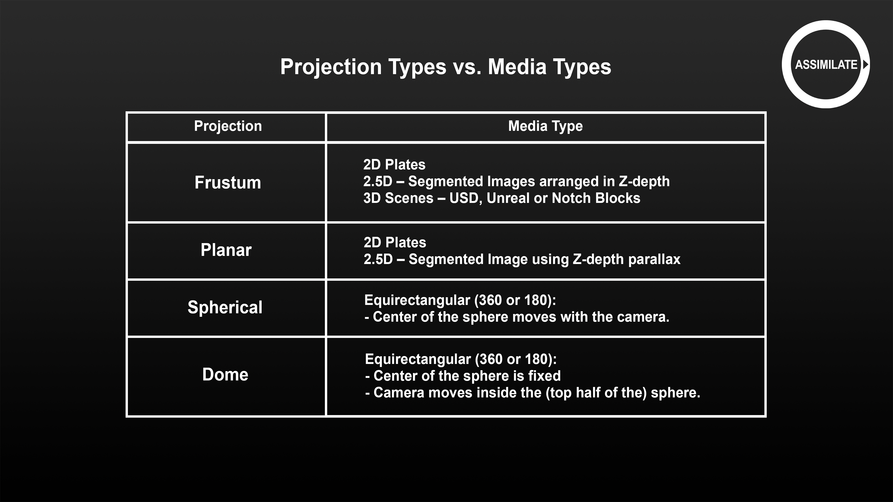<figcaption></figcaption></figure>

From the table you can see that Live FX Studio provides 4 different projection types: Frustum, Planar, Spherical and Dome. Note that Dome is presented as a separate projection type but can also be viewed as a special case of a spherical projection. Effectively, Live FX Studio has 3 different so-called projection nodes that take in the actual media and generate the image for the LED wall, using the Stage Manager and the camera position.

Before we go into the details of the different projection nodes, let’s discuss the different types of media to work with: 2D pre-recorded plates, 2.5D segmented plates, 3D scenes and 2D extracts thereof as well as equirectangular media.

First about 2D media. Effectively any 2D image can serve as a background for a scene. However, for the resulting image to look 100% correct, the recording camera will need to have the same field of view as the camera that originally recorded the 2D image and needs to be placed exactly perpendicular to the projection.

<figure>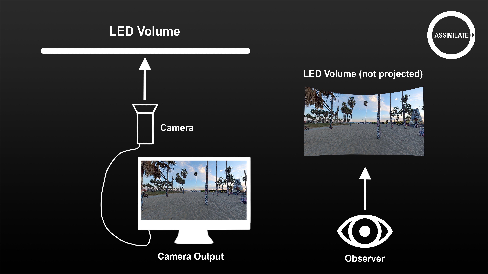<figcaption></figcaption></figure>

When viewing a 2D image under an angle the resulting image will show distorted. The amount of noticeable distortion depends on the angle as well as the content of the 2D image. In an indoor scene with objects close to the camera the distortion will show up more than in a scene of a vast landscape with the horizon far away.

<figure>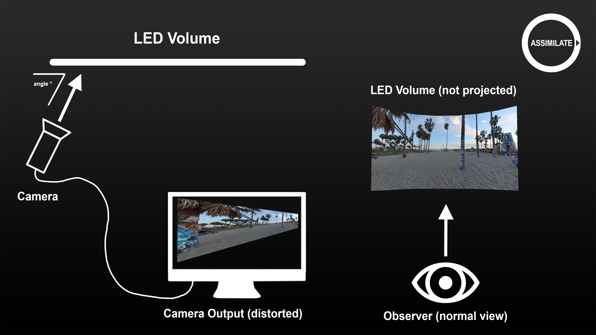<figcaption></figcaption></figure>

<figure>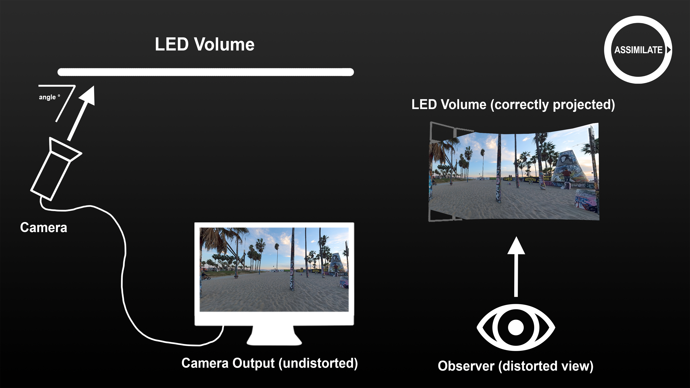<figcaption></figcaption></figure>

Please note that the effect of the angle of the camera with the projection wall has nothing to do with the shape of the wall. You can project a 2D image perfectly fine on a curved wall. The Live FX Studio projection will compensate for the curvature. However, if the camera looks at the curved wall under an angle, the same limitations apply as for a straight wall.

<figure><figcaption></figcaption></figure>

<figure><figcaption></figcaption></figure>

Live FX supports different types of 3D media: USD scenes using the Pixar Hydra renderer, Notch Blocks or integrating with Unreal Engine. In all cases a 2D image is rendered from the 3D scene by controlling a virtual camera inside the 3D scene. By ensuring that the virtual camera has the same properties as the physical camera, the 2D image can serve as a correct background on the LED wall to be captured by the physical camera.

<figure><figcaption></figcaption></figure>

As an example, here we loaded a USD scene in our project. When we open that in the player you can see the 2D rendered output. In the node menu of this shot you can on the first tab position the 3D model itself. On the second tab you can position the virtual camera in the 3D scene as well as set the field of view of the camera. On this tab you also have the option to Link to the Shot camera. When this is enabled, the virtual camera in the 3D scene uses the data which is set for the shot in the Camera menu. In a projection setup the shot camera again is usually live-linked to a camera tracker, tracking the physical camera. In that way all the cameras are in sync.

Using a Notch block 3D scene or using an Unreal scene work in a similar way, as the USD scene. The result of each of the 3D scenes is a 2D image that is rendered based on the actual camera position, ready to be projected onto the LED wall.

2.5D media is, as the name suggests, media that holds the middle ground between flat 2D media and a full 3D scene, in which one can move in any direction. 2.5D media comprises a scene that is segmented in into several 2D layers, based on the distance of objects. Each of those layers is then placed at different positions in Z-depth in a composition shot that uses a virtual camera with the same properties as the physical camera. Moving the camera will create parallax, perceived as 3D, even though the result is again a 2D image that is projected on the LED wall.

<figure>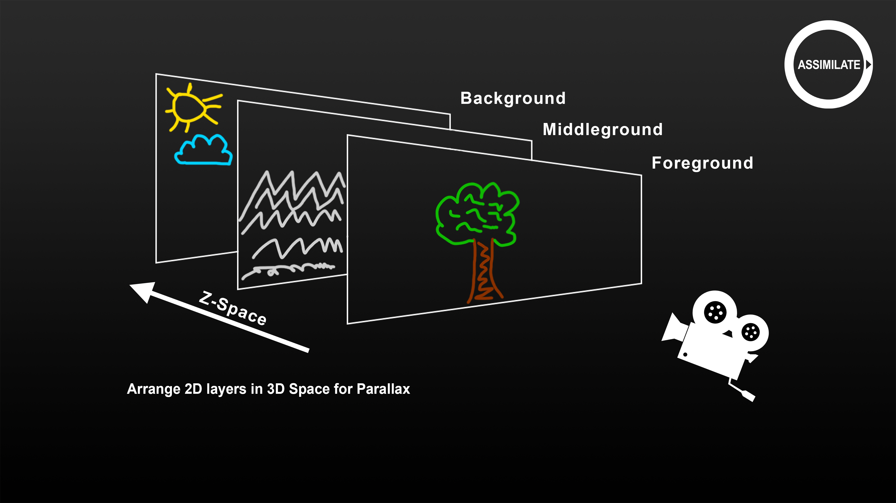<figcaption></figcaption></figure>

Let’s have a look at an example. \[move to the player with an example shot]. Here we have a composition shot with 3 layers. \[layer list] Each of the layers contains a segment of the complete shot. We can see that by deactivating all layers and then activating them one by one.

All the layers are placed in a 3D space in front of a virtual camera. In the canvas menu we can see the Z-position of each layer. We can show the setup even better by opening the perspective view. First, we open the pan-zoom tool from the top menu. In there we have the camera tab, from where we can open the perspective view – alternatively, we can use hotkey “P”. This shows us the layered setup with the camera. You can rotate this view by dragging it, pan it by holding the space bar and zoom it by holding down the Control key and dragging the view. Open the Camera menu to adjust the camera position.

If we now close the Perspective view to return to the normal viewport and continue to adjust the camera position, we can see the parallax effect caused by the different depth positions of the layers.

So far for the elaboration on 2.5D media.

This leaves the equirectangular media type. Let’s have a closer look.

As you probably already know, an equirectangular shot stores an image that is effectively a 360 degree sphere, which you can view from the center in all directions. Here we have such a shot. To ensure that Live FX Studio processes the shot correctly by default it is recommended to tag the shot as an equirectangular shot, if it has not been automatically tagged when loading. If we select the shot and open the metadata stack here on the right, we can see the projection type option and update that to Equirectangular 360. Please do not confuse this metadata item with the LED wall projection type. This metadata item does not directly affect the projection on the LED wall other than setting the correct default when we create the projection composition shot. This tag only tells Live FX, that this shot is an equirectangular 360 degree shot – nothing more.

Now let’s open this shot in the player and first look at the raw image, which looks like a world globe stretched to a rectangle, which is in fact exactly what it is. Since we tagged the file as equirectangular we can use the globe button on the toolbar to switch the viewport to 360 view. In this view you are looking from the center of a sphere to the outside. You can rotate the sphere by dragging the image in any direction. Alternatively you can also open the Pan-Zoom tool from up here and use the 360 tab to adjust the view. Here we also have a setting to adjust the field of view from the center of the sphere. Now the globe option in the player is a setting for the viewport to quickly view your 360 content. It is not what is used for LED projection, but the projection type for equirectangular media uses similar functions and settings. The same applies to 180° footage.

360 media is often formatted as equirectangular but there are other formats out there as well, such as cubical or for example a cylindrical format such as we have here.

Strictly speaking is cylindrical media not 360 as it is missing the top and bottom but it represents a great panoramic shot that is often used in virtual production, where an eventual ceiling wall is being fed by a separate shot to simulate for instance the sky. To be able to process this shot without LED projection, we first convert it to equirectangular. We do this by selecting the VR-Transformer plug-in that comes with Live FX Studio. We apply this plug-in on the source shot – not as a layer on the source shot. If we quickly look at the node tree over here, we can see the source shot, feeding into the plugin node. Now, the plug-in has a list of possible transformations, one of which is the Cylindrical to Equirectangular. When we select this, we get additional parameters to filter out any possible overlap that might exist on both sides of the image. This setting could also be made negative in case the cylindrical does not cover the full 360 degrees of a sphere. The tilt setting can be used to adjust the center of the sphere up or down in case the original recording camera was setup at an angle.

By adding the VR Transform node, the aspect of the shot is also set to 2 to 1 as we can see in the metadata list. We can also see that the shot has been tagged as Equirectangular. As such we can now use the globe button again to switch to 360 view and pan around in the sphere. Now all that is missing, is the projection node on top, that brings the now-equirectangular content onto the LED volume.

The node is now ready to be used in a spherical LED wall projection.\
Note, that the manual steps we just went through are not even necessary in most cases. When dropping the original source shot into the Projection Setup panel, we can tell Live FX Studio that the underlying media is cylindrical. Upon creating the setup, Live FX Studio will create the exact same node tree as before, with the projection node on top. It is however still good to know how to navigate the setup, in case we have to dial in any tilt, or overlap on the VR transformer node.

Ok, so these are all the types of media that we can use for projecting on an LED wall. Let’s now take a close look at the actual projection setup.

In the first part of this tutorial, we showed the basics of projection for LED volumes.

We set up our LED wall in the Stage Manager and created a mapping to the dual head output. We have a source node with the media that we want to project, and we added a projection node that takes the source node and stage manager data as input to create the output for the projection.

In this part of the tutorial, we add camera tracking and a camera profile to the mix to make the setup complete.

Open up the Projection Setup Panel. In this first example we will do a frustum projection with our USD shot. First, we can see that the stage setup we created in the first tutorial is still active. Next, we drag the already loaded USD shot into the panel. Maintain the Frustum projection type. And then we setup the camera. We have created a profile earlier which we will use and explain in a bit. And we use the HTC Vive Mars camera tracking solution that we have setup at our office. As you can see, Live FX Studio supports many different camera tracking solutions. For our demonstration the midrange Mars Vive system works well.

Let’s click create which takes us into the player with a new projection composition.

Let’s go over the different aspects of the projection composition. First, let’s have a look at the camera tracker. Open the Live Link panel from the Live FX menu. If we select the Mars Vive tracker, we can see the tracking data coming in.

If we open the camera menu, we can see that the tracking data is live linked with the shot camera. What we can also see in the camera menu, is that the focal length of the camera has been set according to the camera profile we selected earlier. You can store and load camera profiles from the section down here. Note that we have a separate tutorial about camera calibration, storing the results as a profile and live linking the virtual shot camera with an external camera tracker.

Just as a quick reminder. To manually tie a camera tracker to the shot camera, switch on the camera tracker in the Live Link panel. Depending on the camera tracker type you might need to provide the connection data. As soon as the tracking data is coming in, simply click the Apply button to live link the camera of the current shot.

Now, let’s open the stage manager and the projection node menu. That way we can see the effect of the various settings of the projection node on the image on the wall.

As we saw in the first part of this tutorial series, in the camera tab of the projection node we link the projection to the active camera, which in this case is tied to our camera tracker and on the other side we tie the projection to a wall in the stage manager to create a projection of the correct shape and resolution.

Now if we pan the camera, we can see it directly affecting the image that is sent out to the LED wall.

Looking at the wall projection in the stage manager we can see the inner and outer frustum being projected and moving with the camera. In this setup the physical camera has the same field of view as the virtual camera, so it does exactly see the inner frustum as displayed on the wall. However, under certain conditions the actual camera might still view a glimpse of the outer frustum that is projected on the wall. For instance, latency in the pipeline might cause that a pan of the camera is only visible on the wall a few frames later. Or the camera calibration resulted in an effective field of view that differs ever so slightly from the actual field of view of the physical camera. To counter these effects we will add a so called over-scan region to the inner frustum.

In the Projection node menu there is a Field of view Factor setting that you can use to extend the inner frustum outward. So, let’s add 5% over-scan.

Now remember, we are projecting the 2D output of a 3D scene which is also generated based on our camera settings. To ensure that the image that we project remains correct we also need to extend the 3D render camera. So, as we showed earlier in the tutorial, open the node tree view here on the right. To make sure that the view does not change, ensure that we have it locked with the lock button here. Then select the USD node.

In the camera menu of that node we also add the same factor. So now the output of the 3D scene is the same as the frustum that we project.

We could also have this achieved by adjusting the focal length of the shot camera in the camera menu. However there are a few reasons why you would use the Field of view factor rather than adjusting the shot camera. First, the shot camera parameters might be used by other parts of your composition, that do not need the factor. Second, you might have live linked the shot camera, using dynamic tracker data. Third, when you for example record the scene and enable writing a side car file with camera metadata, then you would want the actual camera settings to be accurately recorded. Any dialed-in factor should be stored separately.

Till so far, the inner frustum -  let’s take a look at the outer frustum. In the background tab of the projection node you set what to project in the outer frustum – or in other words: The background to the frustum.

By default, it takes the image of the inner frustum and then fits that on the outer frustum. To distinguish between the inner and outer frustum, you can use the gain setting, with allows you to either dim down the outer frustum or highlight it. In many scenarios, the content inside the frustum can be easily distinguished from the background without changing its brightness, though.

Later on we will also show methods to grade the inner and outer frustum separately.

Now, instead of automatically fitting the content of the frustum to the background, you can also scale and offset it manually by switching off the Fit option. Like this.

Alternatively, instead of using the inner frustum image you can also choose to extend the outer pixels of the inner frustum over the remaining part of the LED wall.

Note that if the inner frustum image content has some action in it, this might give a rather volatile effect on the rest of the wall.

The third option for the outer frustum is to use a different shot altogether. To do that we need to switch to the Inputs menu. This menu is a generic menu, available with any effect node in a composition. In this menu you manage the inputs of the current selected node, in our case the projection node. As you can see the Frustum-to-wall projection node can take 2 inputs. The first input is our USD source shot. On the second tab, we can load a different node for the background – which is our outer frustum. To get the shot we use the Fetch option to select it from the construct.

Here we have our shot, but we could also select it from a different construct via the project tree, or instead of using the Fetch option, use the import option and import a clip directly from disk. That said, let’s take this shot, which is actually the cylindrical shot that we used before and converted to equirectangular. We drop it into the Inputs menu and as you can see the outer frustum now shows this shot.

And because the shot that we added as input was correctly tagged as equirectangular, we can now use the pan, tilt and roll controls to adjust the view to the portion of the sphere that we want for our outer frustum.

Now, taking a quick look at the node-tree, we can see the newly added outer-frustum background clip in the composition. This means that we can easily navigate to that shot and for instance color grade it separately.

Ok, that’s it for the Frustum projection. Let’s move on to the Planar Projection.

To demonstrate the planar projection, we are using regular 2D media, in this case driving plates, used as a background for a car scene.

The first step is to load the driving plates. Click the Import Clips button and select the folder with your driving plates. Now in this case we have a series of plates all shot from different angles on a car.

We can load the plates all at once by enabling the Select Folder option. To ensure that all plates are loaded into a single slot on the construct, we ensure that the Depth option is set to 0. The specific value that you need depends on the folder structure in which the media is stored. Please check the manual for details regarding the Depth setting in the file browser. Hit OK to import the clips.

Now we can see all the available plates with this scene. Let’s have a quick look at them.

\[open the player and version stack and jump through the plates]

Note that in some cases, the different plates are stitched together to a single equirectangular shot but often you will need to work with the individual 2D angles.

Ok, now that we have seen them, let’s use this angle for our background projection.

We start as usual in the Projection setup panel. Select stage, drag in shot and make sure the Planar projection is selected. Next select the camera profile as well as our tracker. Click create and we’re back in the Player. And just like we did before, let’s go over the node menu. In the first tab we tie the projection to the wall in the stage manager, nothing new.

On the second tab is where most of the magic happens. Here you define an image plane.

Whenever you have a Planar to Wall projection node loaded in the player, then the stage manager will show the projection plane of that node.

Keep in mind though that the plane is tied to the node, not to the wall. Each instance of the planar projection node has its own projection plane, even if they are placed inside the same stage or behind the same wall.

Let’s position the image plane directly behind the LED wall and scale it up a little, so we can cover most of the LED wall with the imagery. Now how does this work.

The source image gets projected from the camera position onto the image plane. The projection node then calculates, where each pixel on its way from the camera position to the image plane, hits the LED wall.

As you can see when you change the position or size of the plane in the node, the actual projection onto the wall also changes. Same for the camera’s xyz position. The camera rotation does not affect the projection, because the projection is based on the image always filling the full plane based on the camera position.

With the planar projection it is relatively easy to setup your background without having to adjust the scene in front of the LED wall. You usually want to position the plane perpendicular to the physical camera and then scale the plane to get the correct proportions with the scene.

The output of the planar projection does not necessarily cover the full wall. This depends on the position and size of the image plane. However, you can enable the background option to reuse the plane image and fit it on the black parts of the wall. Alternatively, you can also, just like we did with the frustum projection, load an entirely different shot as background image in the Inputs menu.

Now, before we move on to the other projection types, let’s quickly show how easy it is to switch plates. We can obviously create a new projection composition from the Construct. However, an alternative is to create a version of the current projection composition we have from the version stack/ Just click add version and we can see a copy has been created.

Next, we open the node-tree, where we can see the base shot.

Then select the Fetch option and select a different plate from the series we loaded earlier by clicking  it in order to attach it to the cursor and then Close the Construct. If we now hover above the source shot, we can select the Replace option, which then just replaces the source shot in the composite and leaves the rest of the planar composition as is.

In most cases though you will want to adjust the image plane a bit to get a different angle of the projection. But any grade – if we put that on the projection node – is maintained.

This concludes the Planar projection, let’s quickly continue with the last two projection types: the spherical and dome projection.

As usual by now, we start in the Projection Setup panel. Select the stage, and this time we drag in an equirectangular shot. Because it is tagged equirectangular, the media type here is automatically adjusted and so is the default projection type. We set the camera profile but this time for demonstration purposes we will not use the camera tracker because we want to manually adjust the shot camera position.&#x20;

We do enable the frustum highlight option so we can show a bit of inner and outer frustum color grading.

Click create and here we are in the player again.

Let’s again first have a look at the menu of the Equirectangular to wall node. On the first tab, we see the familiar link to the stage manager. And on the second tab we have the link to the shot camera as well as Pan, Tilt and Roll controls that allow you to dial in the default orientation of the sphere that we are projecting onto the wall.

In an equirectangular projection, the physical camera represents the center of the sphere, replacing the original physical camera that recorded the shot in the first place. The projection radiates out in all direction and hits the led wall under a certain angle.

<figure><figcaption></figcaption></figure>

 

<figure>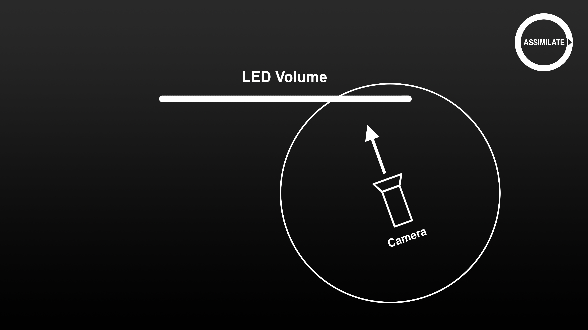<figcaption></figcaption></figure>

Let’s open the stage manager again to see the effect on the LED wall and open the camera menu. Remember that we did not tie the camera to a tracker so that we can easier demonstrate the effect of repositioning the camera. Because if we move the camera in XYZ then effectively we move the center of the sphere right with it. The image radiates out in all directions then hits our LED wall from a different angle as before.

This also means that if we rotate the camera, the projection is not affected as the center of the sphere stays in the same place.

Now, let’s return to the node menu and adjust the pan, tilt and roll there. As said, this changes the default orientation of the sphere. As you can see, the frustum display stays at the same location on the LED volume.

Speaking of the frustum display. This is not part of the projection node as we saw with the Frustum and Planar projection. Remember we selected the Frustum highlight when we created the spherical projection. Let’s open the node tree view as well as the Layer list. In the Layer list we see two layers – the inner frustum layer and the outer frustum layer. Each of which can be graded separately.

When we look more closely at the node tree, you can see that each of the layers has a matte input. You can tell by the little M displaying above the node icon. Let’s select the node but remember to have the lock view enabled so that we can see the node in context.

When we look at the node menu, we can actually see that this is a Frustum to Wall node. The same node that we used earlier for the frustum projection. The node is normally linked to the stage manager as well as to the shot camera. The secret of this node is however that it also generates a matte for the frustum, based on the wall and camera position.

We can see the matte, by toggling the alpha channel button on the toolbar here.

Let’s go back to the top projection node and adjust the rotation of the camera in the camera menu. Now we can see the frustum rotate with it. Let’s go back to the normal RGB view, and now select the Frustum Inner layer and open the Fill-Matte menu. In the Matte menu we can see that the Alpha channel is selected. When we click the Frustum Outer layer, we can see that in addition the Invert option is enabled. This inverts the matte so that we have a matte for the outer frustum.

Now with each layer tied to a matte we can grade the inner and outer frustum separately. We can select the inner frustum and give it more contrast - like so. And we can select the outer frustum to dim it down even more and give it a bit more or a red glow.

Of course we can also at any time create a new layer in the layer stack, and by not feeding it any matte whatsoever, color grade the entire LED wall output.

Now for the final part of this section in the tutorial on projection we discuss the Dome projection. For this we actually do not create a new projection but stick with the current and focus our attention on the node menu of the Equirectangular to Wall node. Make sure by the way to select the Primary layer in the layer list rather than a specific layer. With the primary layer selected, we get the controls of the current node in the node menu. With any secondary layer selected, this menu is either empty, or will show the node controls of any plugin node, feeding into the Fill of the selected layer.

The Dome projection is a variant of the spherical projection which is controlled by this section of the equirectangular projection node. Using the dropdown, you can select either a spherical projection or a Dome projection. Here is a schematic to better understand the difference.

As we already mentioned, in a spherical projection the center of the sphere moves with the camera. In a Dome projection however, you set the center of the sphere manually and the camera then moves inside the sphere – which in that case is cut in half to represent a dome.

<figure>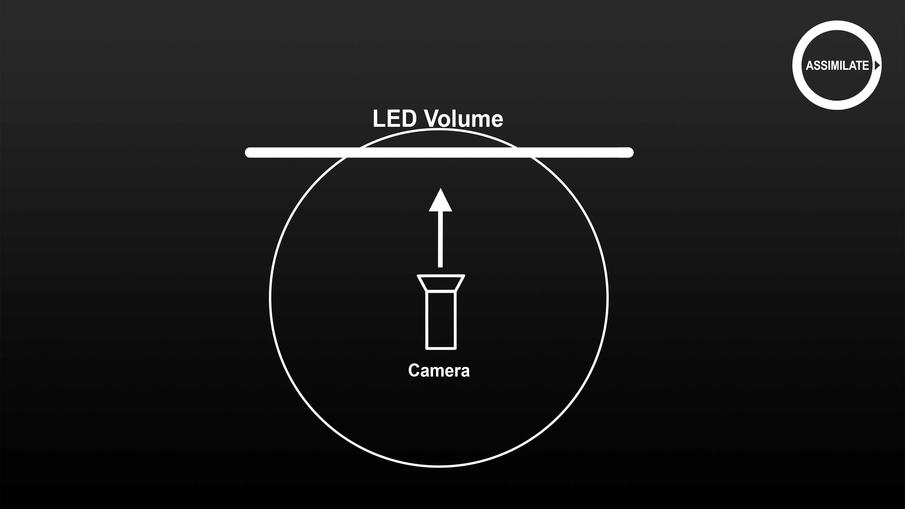<figcaption></figcaption></figure>

 

<figure>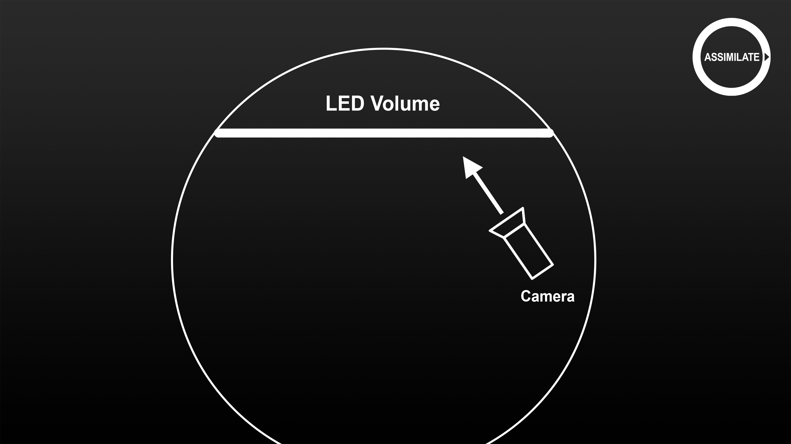<figcaption></figcaption></figure>

 

<figure>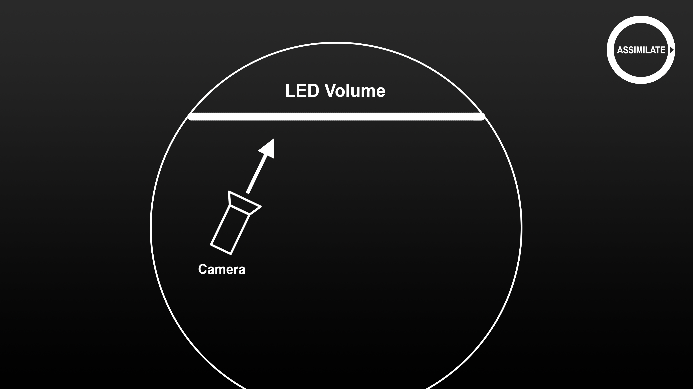<figcaption></figcaption></figure>

The reason for using a Dome is exactly because you do not want the center of the sphere to move with the camera. At the same time, moving inside the dome of pre-recorded media easily leads to a distorted view and parallax artifacts.

Here we have a car shot with a spherical projection of a car in front of the wall and the camera looking through the car. Through the lens the road behind the car looks perfectly straight. If however, we now would move the camera to the left or right of the car, the center of the sphere changes and the road would no longer appear to be exactly straight behind the car.

To prevent this, we select the Dome projection. Then set the center of the sphere using the XYZ controls. Note that the XYZ controls relate to the same origin as in the stage manager and the camera tracker.

Next to the XYZ position, we also need to indicate the size of the sphere by setting the radius. Internally, the sphere has just a radius of 1. However, the system needs to understand how much to offset when the camera moves, for instance 1 meter to the right. Note that this is always an estimate.

The Floor setting determines where the sphere is cut in half and allows you to align the horizon of your scene. Note that this easily results in distortions of the image, especially on objects that appear close-by. In general, using a dome projection and adjusting the floor level works best for scenes of wide-open spaces with few objects close to the original recording cameras.

<figure>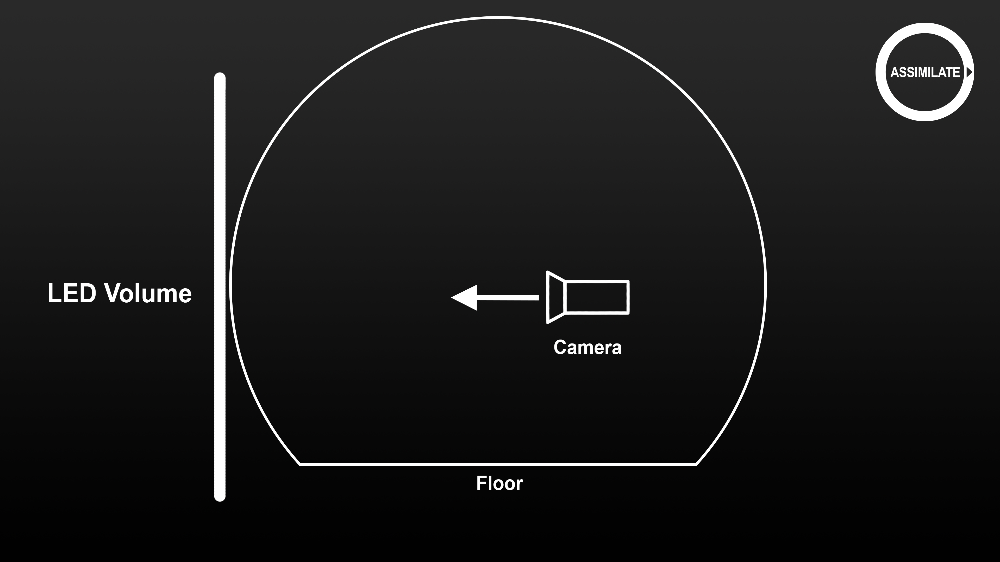<figcaption></figcaption></figure>

 

<figure>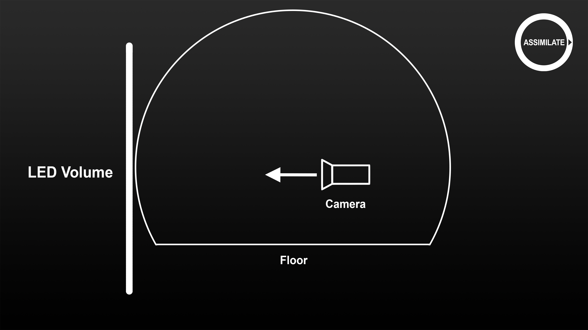<figcaption></figcaption></figure>

This concludes the part of the tutorial about LED wall projection. In the next part we are going to take a closer look at more complex setups with multiple walls or walls that are controlled by multiple LED wall processors.
