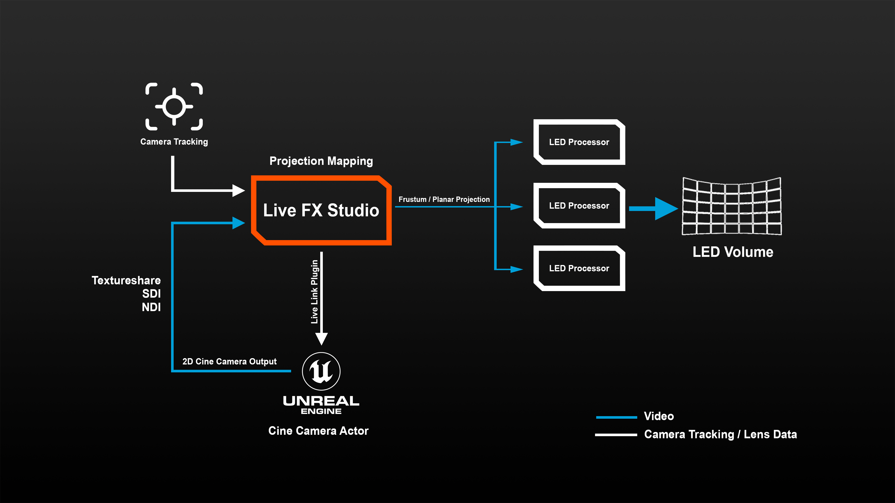
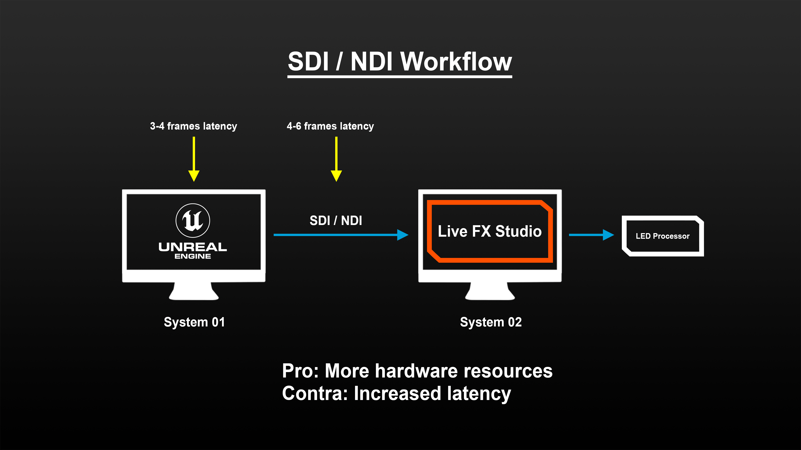
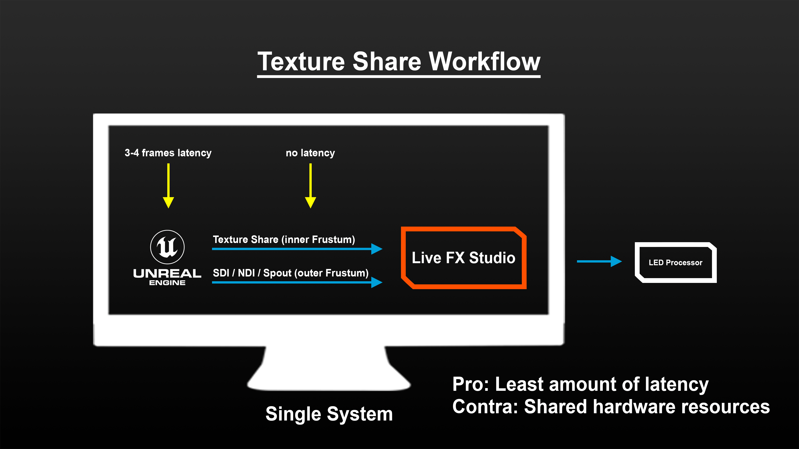

# Part 4: Projection Mapping with Unreal Engine

Here is the Youtube Video for this part, if you rather watch, than read  ;-) .



In this part of the tutorial about LED wall projection with Live FX Studio, we dive into Unreal workflows.

&#x20;

Now with most other applications, this involves the setup of ndisplay within your Unreal scene.

With Live FX Studio this is not necessary, since our workflow does not rely on ndisplay. As we showed in the preceeding parts of this tutorial series, Live FX Studio has its own projection functions, using the stage manager. Generally, our workflow with Unreal looks like this:

<figure><figcaption></figcaption></figure>

&#x20;

As we have already seen, Live FX can capture tracking data from a wide range of camera tracking solutions or it can animate its own virtual camera. It can forward the camera data to Unreal using a dedicated Live Link plug-in for Unreal. In Unreal the Live link plug-in is tied to the virtual cine camera actor, which generates a 2D image of the scene. This image is sent back to Live FX Studio, either by using texture share functionality to share the image directly on the GPU between the two applications or by outputting an SDI or NDI signal which is captured in Live FX Studio.

&#x20;

From there Live FX Studio projects the 2D image just like it does with pre-recorded media – either using the frustum or the planar projection method and the stage manager setup.

&#x20;

To make managing the Unreal scene easier, there are various additional ways to control and communicate with Unreal directly from the Live FX interface or by using hardware to trigger certain events. You can for instance use Open Sound Control or an HTTP web interface to trigger actions or toggle elements on/off in the Unreal scene, like for example adjusting the position of the sun in the scene. Some of these techniques we will cover in a separate tutorial on advanced Unreal workflows. For now, let’s concentrate on getting the correct input from Unreal for projection on the LED volume, using Live FX Studio instead of nDisplay.

&#x20;

So let’s have a look at the different techniques for getting the image from Unreal into Live FX.

<figure><figcaption></figcaption></figure>

 

<figure><figcaption></figcaption></figure>

&#x20;

Each of the techniques has its pros and cons. If you use SDI or NDI then you can have Live FX and Unreal run on different systems, each utilizing its own hardware to the fullest. This does however introduce some extra latency to the signal, since it first needs to be sent from one system to the other and then on to the LED processor.

&#x20;

By default Unreal has around 3 or 4 frames of latency, from receiving camera tracking data to rendering the output. Outputting an NDI or SDI image adds another couple of frames of latency, totaling up somewhere between 7 and 10 frames, before Live FX can receive the signal. When dealing with a still frame scene or very little action, this might not be a problem, but with many scenes this amount of delay is too much.

&#x20;

In that case, you should consider using the texture share option for the primary inner frustum image and possibly consider using an SDI signal for the outer frustum image.

The Texture share does not add any latency to the signal as the image is shared directly on the GPU. It does require however that both Live FX Studio and Unreal run on the same system, which means that they need to share hardware resources of that system. In this tutorial we will use this Texture share method.

&#x20;

Now, let's start with the setup in Live FX Studio.&#x20;

From the Construct tab, we open the familiar Projection Setup panel and we are using a stage with just a single LED wall.

Next, instead of dropping in any kind of pre-recorded media, we select Live Capture and then Unreal Texture Share.

The media type remains set to 2D, since what we get sent from Unreal is the 2D output of the cine camera actor we're about to set up.

The projection type we want is Frustum, since we will only get the inner frustum from Unreal.

&#x20;

Lastly, select the Intel RealSense tracker protocol which gives us the tracker data from our RealSense tracking device that we have setup in our office and select a camera profile which we created earlier. Please note that the camera profile is just as important as the tracking data. In the Unreal workflow, Live FX also passes on the camera field of view information to unreal to make sure it renders the correct frustum image. If you were to pass on lens data that does not match with the physical camera that you are working with, then the frustum image that is being projected does not match with what the physical camera is actually seeing. So, very important to have that correct.

&#x20;

All done here, hit the create button and we’re back in the player.

&#x20;

As you can see, we're being shown a lot of checker board here, since we do not yet receive an image from Unreal.

Don't worry, we'll get to that in a just a bit.

If we look at the node tree, we can see the Unreal Texture Share Capture node at the bottom, feeding its output into the Frustum-to-Wall projection node.

Looking into the node menu, we can see that the Frustum-to-Wall plugin is already linked to the Stage Manager and to the shot camera.

The shot camera again is linked to the camera tracker, as we can see in the Camera menu.

And if we open the Stage manager, we can see it all together with the camera panning and the frustum on the LED wall.

&#x20;&#x20;

Now, before we move on to the Unreal side of things, we first want to make sure that Live FX will share the camera tracking data with Unreal. For that, we open the Live Link panel from the Live FX menu and select the Unreal Live Link. Make sure that the live link is enabled and that it is connected to the correct port and ip address. Since we will be using Unreal on the same system, we can use the standard local host ip 127.0.0.1 and we’ll leave the port number to its default. As soon as we hit Connect, we see a counter running, indicating that camera tracking data is being sent out.

&#x20;

Ok, for now we're done in Live FX. Let’s minimize it using the top right button, and let’s move on to Unreal Engine.

&#x20;

So, here we have a stock Unreal scene, right off the Epic Marketplace.

Before we open the project, we need to include the Live FX Live Link plug-in and ensure that texture sharing is enabled in the project. You can download the Live FX Plug-in from the [**Assimilate Support site**](https://www.assimilatesupport.com/akb/Download51050.aspx) where there is a version available for each Unreal version.

&#x20;Once downloaded and unzipped, place the Live FX folder inside the Plugins folder of your Unreal project. If the Plugins folder doesn't exist, simply create it manually. Once done, you need to restart Unreal.

&#x20;

When you install the Live Link Plug-in, this should also automatically have activated the texture share plug-in. Let's check this. Open the Plugin browser and check for the Live FX plugin. We can see the Live Link plug-in is enabled and so is the Texture share plugin - perfect.

&#x20;

But we’re not done yet in Unreal so let’s go to the Windows dropdown ==> Virtual Production ==> Live Link. Hit the big Plus button, select the Live FX Live Link to add it to the project - the dot on the right side shows green because Live FX is already sending data. If it is yellow, check the network settings on both ends to make sure Unreal is able to receive the data being sent out of Live FX. One important thing: Make sure that the Interpolation dropdown is set to “none”. If you don’t do that, you might see jitter in camera movement later on. What we also want to do, is set this live link as the default for the project, so next time we open this project, we do not have to set it up all over again.\
For this, we first need to save a preset of our current live link configuration.\
Next, go into the Project Settings and search for live link in here we have the just saved preset.\
Simply select it and close the settings.

&#x20;

Okay, next we need to add a Live FX VP camera to the scene – we can simply do that by hitting the new button up here. The camera will be placed either at the scene origin at 000 – or if we have already filled in an offset in our Unreal Live Link panel inside Live FX, place it at that position. Let’s select the Camera Actor in the Outliner window – it is already live-linked and ready to share its output via texture sharing as soon as we play the scene.

No further settings are needed.

&#x20;

Let’s check a couple more aspects.

First, since we are currently running Unreal from its editor, we need to make sure that it is also rendering at full speed when it is not the active application. If you open the Editor preferences panel and search for CPU, make sure that the „Use Less CPU when in the background„ option is switched off.

&#x20;

Next, we need to ensure that Unreal is running at the correct framerate. By default an Unreal project runs at a variable framerate. In case you would output through SDI then the SDI plug-in in Unreal would ensure a constant framerate. When doing a texture share, Live FX will dictate the frame rate through the live link plugin. That frame rate is the frame rate of the shot inside Live FX.

&#x20;

As we have shown earlier on in this tutorial series, you can see the current framerate of the player in the Settings panel. Also, since we are outputting to the LED wall through the dual head output, ensure that the V-Sync option is enabled.

To get the best projection playback on the LED wall, all these settings should be aligned: the Live FX framerate, V-Sync option and the Unreal framerate.

Ok, next thing to consider is the resolution and aspect of the image from Unreal. When using Video IO out from Unreal this is all determined inside Unreal. When however using the Texture share there are a few things to keep in mind to prevent unnecessary scaling or even using the wrong aspect ratio.

&#x20;

So, the first thing to determine is which resolution do you need and how to get that resolution. To answer the first part, let’s look at the Stage Manager.

We need an image for the inner frustum on the wall. Since we know the resolution of the full wall, we can make an estimate of the resolution of the inner frustum. In our case the frustum takes about half of the width of the wall and about 80% of the height. Now obviously the frustum size might change if the camera position changes. But we are not after an exact size. All we want to know is whether the frustum size lies well within one of the standard sizes: HD, 4K or maybe twice 4k. In our case the frustum fits well within a 2k image.

&#x20;

So how to get a 2k texture share image. Let’s return to Unreal. The texture share goes through the Unreal Viewport. And there are three ways to start the viewport which we can select from the Play mode menu pressing the 3 dots button. You can use the selected viewport…….  And then manually resize it like this.

&#x20;

Let’s briefly switch back to Live FX and in the node tree view, select the texture share node. Looking at the resolution of this node in the media menu, we can see that it follows the resolution of the viewport that we set. This is in fact a setting in the node menu. If we would switch off the Auto resize then the node maintains its size and fits the image that is shared from Unreal into that size, in which case we might lose part of the image, as well as potentially squeeze it. We should leave the Auto size enabled.

&#x20;

Back to Unreal. As we saw, we can adjust the viewport size manually. Alternatively, we can also use quick keys Shift + F11 to switch the viewport into immersive mode and use the full screen. That is the maximum resolution that you can get from this play mode. If you happen to have an HD screen then you can only get an HD texture share image.

Now, we can also switch the play mode to a new View port. With this setting we can actually set a specific viewport size by opening the advanced settings and adjusting the width and height. Let’s for instance set this to a 2k size and then start the scene again.&#x20;

&#x20;

There, now we have a rather fixed size viewport. Note however, that you cannot set the size of the viewport to a size higher than the resolution of the physical display you are working on, so in most cases, a monitor with UHD resolution would be recommended.

&#x20;

If you need a resolution higher than the monitor that you are working on, then you should use the third option and that is to start the scene as a stand alone instance. Effectively this means that another instance of Unreal is started. This is similar to creating a compiled version of your scene that creates a separate executable.

&#x20;

Although you can set any custom resolution for a stand alone version of the scene, you also need to ensure that other settings, like the live links, start working by default as you will not be able to access the settings anymore through the editor. This all is not part of the current tutorial but to be discussed in more advanced tutorials on Unreal workflows.

&#x20;

For now, we use the separate viewport, which will run at 2K resolution.

&#x20;

Next, the aspect ratio of the texture share is probably even more important than the exact resolution as we do not want to squeeze or stretch the image. In a nutshell: The aspect of the texture share needs to be the same as the camera sensor’s aspect as per the Camera menu in Live FX

Meaning: If my camera sensor has 16:9 dimensions, like it has here, then my texture share – or in other words: view port in Unreal – needs to also be of 16:9 aspect - which is the case with our currently 2K-sized Texture share.

&#x20;

Maintaining the correct aspect is twofold.

First, make sure that the Auto update lens settings in the Unreal Live Link is enabled.

This ensures that the camera settings, including the sensor size in the camera menu is passed on to Unreal and applied in the Unreal Cine Camera.

Next, ensure that the Keep Aspect option in the node menu of the Texture Share node is enabled.

The texture share from Unreal is the size of the viewport, as we have seen earlier. However, although you see black envelopes in Unreal viewport when the aspect is not aligned with the camera, the texture share image is stretched over the entire resolution. Enabling the Keep Aspect option forces the image into the same aspect as what was set in the camera menu.

&#x20;

Now, we’re almost fully setup. 3 more things to check and consider.

First we revisit the latency aspect. In our current setup we are using the texture share for getting the Unreal image, which in itself does not add any latency but as we mentioned before, Unreal itself has an inherent latency of about 3 or 4 frames of processing from receiving the camera tracking data to the outputting of the rendered image.

This causes a bit of a timing issue between the frustum moving and the content inside the frustum reacting to the movement. The frustum itself is generated by Live FX, the content by Unreal. So when we move the camera, Live FX can move the frustum immediately, but the content inside, which comes from Unreal reacts delayed. You can see this effect easily when doing a relatively quick pan.

The way to counter this effect, is to delay the frustum movement, so it is in sync with the frustum content, that arrives delayed from Unreal.

&#x20;

Live FX detects the delay of the Unreal render automatically, and will delay the frustum movement right away. This way we can see frustum and the content inside moving fully in sync. Just to show you a bit better what this does, let’s go to the camera menu and either click the Link button in the animation section or as an alternative we drag the animate button onto the X-position parameter of the camera.

This opens up the animation editor, showing us all live linked parameters. Here we can adjust the incoming data by inverting it, adding a factor, offset, or normalizing it.

&#x20;

If we display all parameters of the camera – pan, tilt, roll and XYZ position,\
we can see they are all set to Unreal texture delay – nice.

Let's switch that off for a moment.\
See how Live FX immediately moves the frustum, but the content inside the frustum reacts delayed?

Dialing in a manual delay, or just leaving it to the automated Unreal texture delay will make Live FX delay the frustum movement, so that it moves in sync with the content inside, that is coming back from Unreal.

&#x20;

Outputting this scene through the GPU from Live FX Studio is latency free - however, consider the LED processor in between Live FX and the LED wall to add a frame or two.

This would then result in a motion-to-photon delay of 5-6 frames. Yes, a bit higher than with 2D plates loaded into Live FX, but still not bad at all – especially considering that Live FX Studio adds just one frame of delay to the mix at best.

&#x20;

The next thing we want to show is how to align your Unreal scene with the active stage in the stage manager.

&#x20;

As you know, the origin of our stage and the camera tracking system, is represented by the gizmo here in the stage manager.

The Unreal scene has its own origin. And sometimes you want to adjust this for the particular shot that you are creating. You can do this inside the Unreal scene itself but you can also do that directly from Live FX. Let’s collapse the Stage Manager and open the Live Link panel with the Unreal Live Link.

&#x20;

Here we can see that it is still sending out the camera tracking data. And here we also have a number of controls to offset the tracking data. The values you enter here add to the camera position and rotation so that we can move the virtual Unreal camera, independent from our physical camera. That way we can look at the Unreal scene from a different position, or for instance from the other side by adding a Y rotation.

&#x20;

Now that we are here, we can also have a quick look at the Overscan options in Live FX. As you might remember, earlier in this tutorial series we discussed to extend the frustum projection somewhat to ensure that the physical camera never captures outside of the inner frustum projection.

&#x20;

We did this by incrementing the frustum in two places: in the projection node and in the source node. So in the case of Unreal, we can extend the field of view a bit by scaling the Field of View that is sent to the Unreal Live Link plug-in… Let’s set this to 1.05, an increase of 5%.

The next step is then to also add this 5% in the projection node. Open the node tree and select the projection node. Then here in the node menu, we also set the Field of View Factor to 1.05. Done – this way we increase the size of the frustum and at the same time also increased the angle of the content, so that the content is not stretched or appears zoomed-in.

&#x20;

Ok, on to the last topic of this tutorial. The outer frustum. As you have seen so far, the "outer frustum" is simply a copy of the inner frustum and hence moving in sync with the camera.

This might not be what you want.

&#x20;

Earlier in this tutorial series we showed the options for the outer frustum display and how to use an entirely different shot for the outer frustum. In the node menu, Background tab of the projection node you can switch between using the inner frustum as a whole or just extending the outer pixels to fill the background.

We also have the option to use the foreground still. Here is how to use it:\
\

Essentially it will freeze the outer frustum, which again is just a copy of the inner frustum.\
To get a nice perspective, I’ll just quickly offset my virtual camera a couple meters back, zoom out… and then hit the “use foreground still” option.

&#x20;

Now of course I will need to put the camera back to where it was… reset the focal length and the Z position… done. Now let’s take a quick look at what happened behind the scenes.\
If we go to the Inputs menu, we can see all inputs that the Frustum to wall node offers: A foreground and background input. The foreground is essentially the Unreal texture share, which carries the inner frustum. The background up until a second ago was empty, which is why Live FX simply duplicated the inner frustum to serve as its own background. By hitting the “Use foreground still” button, Live FX took a snapshot of the texture share, and placed this still frame here in the background input field.

Nice and easy.

\
This is a great way to fill up the LED wall with scene content to use for reflective lighting.\
Since it is a still frame, it will also greatly save on hardware resources, as these can now be used entirely for the inner frustum – or in other words: Unreal providing bespoke frustum.\
Of course, this static background will only work with scenes, where there are no great dynamics in terms of lighting.

For those scenarios, there are two other options:\
Generally, nothing stops you from clearing the background input, and dropping in something else.\
For instance, a pre-recorded clip, out of Unreal. Simply right-click and hit fetch to fetch the clip from inside the project, or alternatively, hit import and navigate to it.\
Double-click it and it gets attached to your cursor – simply drop it into the background field.\
There you go – now we have some motion in our outer frustum. On top of that, you can set the clip to loop here, if it is shorter than the shot length of the composite shot, that you can set here in the Live FX menu.

Since this is just playing back a clip for the outer frustum, it is also relatively easy on the hardware resources of our machine – but obviously, it is not fully in sync with what’s happening in the inner frustum, that is being sent live from Unreal. However, realistically speaking, it is rarely required for the outer frustum to be 100% in sync anyways.

If however you need the outer frustum to also come live from Unreal, let me show you how to do that as well.

For this we need to create a second live feed out of Unreal.\
Currently, there are some limitations to the way Unreal does texture sharing, which is why we can only have one texture share at a time. So to send a second live feed, we need to use a different pathway. The closest thing to use would be Spout via a plugin. That is also a way of texturesharing, just using a different protocol. An alternative is NDI – also a digital image transfer protocol, but not as latency free as the textureshare option, because here the image is encoded and decoded in between the two applications. Let’s use that for now.

The first thing to do, is to download the NDI SDK for Unreal from Newtek’s website, install it, and place the corresponding plugin into the plugins folder of your Unreal scene. Inside the Plugin Browser in Unreal, make sure that it is enabled.

Now what we’ll do is to set up a second camera actor, push it a little bit back and have it untracked and have its feed sent out via NDI.

Here we go: In the place actors field, search for NDI – grab the broadcast actor and drop it into the scene. Let’s place it back here…. Lift it up a little…. And turn it around.

No need to live link any camera position or rotation – all we want from this camera is a static live feed to use as the background to our frustum.

Next, select the NDI Broadcast actor in the Details window and for the NDI Media Source, choose NDI Media Sender and save it.

Lastly, let’s configure the NDI output by double-clicking the NDI logo right here:\
We are currently running everything at 30 fps, so let’s set the frame rate to that here as well.\
Instead of “Unreal Engine Output”, let’s put a more defining label on here and call it “UE Outer Frustum”. We can dial up the resolution as well, but for reflective lighting, HD resolution is sufficient in most cases, so let’s just leave it at that for the time being. Next, simply close the window, and play the scene again.

\
Back into Live FX.\
\

We now have to add the NDI feed into our existing composite as the background content.

Here’s how to do that:\
Go to the plugin browser, and in the Live FX folder, select the live capture node.\
Now hold down Alt and double-click it. It will be attached to your cursor, so you can now drop it into the background field. As you can see, we’re getting out beloved checkerboard again – simply because the live capture node is not yet configured. To do so, use the node tree and select it there. Go to the node menu, and select the device and the channel and there we have our image.\
If we now go back to the top level node in the node tree, we can see the result combined.\
Now we have two live feeds from Unreal – one from a camera tracked cine camera actor, that is outputting via texture share, and a live, untracked outer frustum feed which we’re getting in via NDI.

&#x20;

Till so far, the Unreal workflow with Live FX Studio. Be sure to check any updates in the documentation about this workflow. Things are moving fast and there might already exist updates and alternatives that were not available when creating this tutorial. Nevertheless, this tutorial should have given you a firm base to create an Unreal – Live FX Studio – LED wall projection setup.
