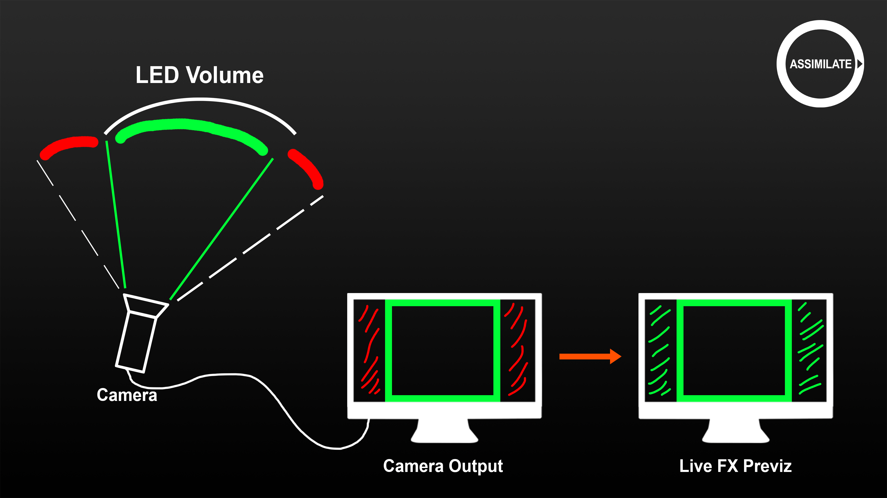

# Part 5: Set Extensions

In this last part of the tutorial, we discuss how to create a set-extension and record the scene. A set-extension is mostly used to previsualize a scene that shoots at a wider angle than the led wall size allows. After recording the scene, you re-create the scene in the post-production phase, possibly using the recorded metadata of the camera and wall positions.

<figure><figcaption></figcaption></figure>

You can also use this technique in a live broadcast setting. This requires an even a more strict preparation to ensure that all settings are correct as there is no fixing in post.

The elements involved in a correct and successful set-extension are: Correct position and tracking of the camera and led wall. Correct setting of the camera field of view. Correct estimate of the latency of the live camera capture. Color grading skills to ensure that the set-extension display matches the live camera capture.

Now, as we saw in the prior parts of this tutorial series, the Stage Manager is where you specify the position and size of the led walls in relation to the camera.

The camera position we get through one of the supported camera tracking solutions. Some of those systems also include functionality to calibrate the camera and determine the focal length and field of view of the camera. If the tracker system does not provide the calibration functionality, then you can use the camera calibration functions inside Live FX Studio.

This tutorial does not cover the details of these calibration functions as there is a separate tutorial available for that. However, let’s quickly summarize.

We’re in the player with a live capture and in the camera menu. From here we can open the calibrate panel. In this panel there are 4 tabs.

In the first tab, you enter the basics of the charuco or checkerboard that you use the for calibration. In the second tab you do a series of scans of a charuco or checkerboard to calculate the actual focal length of the camera as well as the lens distortion parameters. Note that it is important that the camera sensor aspect is the same as the aspect of the live capture that you get.

Once you calculated the focal length and lens distortion, you can apply them to the current shot camera. It is recommended that you also create a camera profile of the outcome, so that you can easily reuse the camera settings for new projections, set-extensions or possible green-screen shoots.

&#x20;

The Nodal point calibration uses a series of charuco scans. The outcome are transformation and rotation offsets that are applied to the tracking device. This is not a property of the camera. Please note that the calibration is rather sensitive.

Do check the results manually by also measuring the position of the tracker device related to roughly the midpoint of the lens entry and the camera sensor position. Compare the outcome of the manual measure and the calibration. In case of huge differences, retry the calibration.

In the last tab you scan an aruco which is placed at the origin of the scene on the stage. This point is the same origin point in the stage manager to which the wall positions are related.

Some tracking systems need to be re-initialized every time they have been switched off or when exiting and entering a project in Live FX Studio. Most high-end tracking systems however do not require any re-base from Live FX Studio.

So, back to the main topic – set-extensions and recording. Let’s start again by creating a projection setup with a 360 equirectangular file and set the camera tracker and profile to use.

\[open the projection setup panel + drag in shot + set camera trackers / profiles]

This time we also enable the Live Capture at the bottom. Note that you need to have enabled an SDI or NDI input. In prior tutorials we showed how to do that from the VideoIO Settings panel which you can open from the startup screen, or the Settings menu in the Player. We have an SDI input enabled and select that.

Next, enable the set-extension option. Note that in some cases it makes great sense to just have a live capture active, even if you do not need a set-extension. Remember that we started this tutorial series with the advice to not look at the wall to validate a scene but rather to look at what the actual camera is seeing. Having a live capture is a great way to see what the camera is seeing and checking your scene right inside Live FX Studio

If you do want the set-extension setup, then the frame delay option is also enabled. We will get into the latency aspect of a set-extension in more detail in a bit – for now it is important to know that any live capture signal usually has some latency compared to the camera tracking metadata. To have a correct set-extension we need to offset for this. For now we set this to 2 frames, but as said – we’ll get back on this and specify a more accurate value.

For now we’re all done here and click Create, which takes us to the player.

First stop there is the node tree view. Since we used a single wall setup, this only has a single projection node. The second branch under the switcher node is the actual set-extension composition.

At the top we have the switcher node, with the channel controller where we can switch between the projection and the set-extension.

Now let’s look at the set-extension in more detail. At the top is the so called Stage Matte node. This node, uses the active stage in the stage manager and the active camera, which is in this case the switcher node that is tied to the camera tracker.

The stage matte node then has two inputs, the same source node that is used for the led wall projection and the live capture node. Since Live FX knows exactly where and what shape and size the LED wall is, as well as from what angle the camera is looking at it, it also knows when the camera is looking at the LED wall and when it is not. The stage matte node can use this metadata to generate a matte, which then combines the projection background and the live camera capture to generate the set-extension image.

To tweak the composite of both, the Stage Matte node has a number of controls. The Invert option completely inverts the alpha. The option is not really used for a set-extension with an LED wall. If however, you would use your LED wall as a greenscreen, then this option gives you an excellent alternative to using a keyer. (or drawing garbage mask?)

The other three options - Expand, Feather and Blend – help you to enhance the transition between the live capture and the projected source.

Note that the blend and feather functions do not come for free so to speak. They do take extra performance. Always check that playback is still realtime. As shown at the start of the tutorial series – open the performance monitor by using the Control or command + F1 quick key. As we can see – this is still a nice straight line.

Now, next to adjusting the transition and the live capture, you probably also want to tweak the grading on the live capture node to get a uniform end result. Navigate to the live capture node – but ensure that the view lock is enabled. Here we have all the grading tools available to make the live capture look the same as the source node.

Note that you do not want to grade the source node as that would also change the actual image on the LED wall – and the camera capture with it – a vicious circle.

Now - let’s finally discuss the latency aspect with a set-extension. As mentioned, a camera live capture introduces a certain amount of latency. When we pan the camera we can clearly see the live capture image starts moving at a different moment compared to the set-extension image. That is because the camera tracking metadata does not have the same – or actually no real – latency as the live capture does.

We need to compensate for the latency of the live capture in two locations. First we are going to delay the camera tracker metadata. Second we delay the source node that is used for the set-extension.

We still have the Stage-Matte node selected. Let’s open the Camera menu. As you can see, the camera is live linked to our tracker. Note that in this setup, if we select the top switcher node, we can see that this is also live linked to the tracker. The reason that both nodes are directly live linked and that the Stage Matte node does not use the camera settings of its parent, is that with this setup we want to set an explicit delay of two frames for the set-extension only. If we had not set a delay earlier in the projection setup wizard, then the stage matte node would have used the settings from the main switcher node and you would not be able to easily set an explicit delay for the set-extension.

Now, back to the stage matte node and then let’s open the animation editor by clicking the Link option to view the actual live link delay.

Here we select all the elements of the tracking: the xyz and pan, tilt and roll. And as you can see here, each of these items has a delay option with it, which is set to 2 frames – the number that we set when creating the set-extension. We can adjust this value – let’s set it to 4 frames. As you can see if we change this for one item, we actually change the delay of all the selected items.

Now to find the correct delay is actually a bit of a trial and error effort. There is no automated way to determine what the delay is. If we pan the camera again, we can see that the live capture and the stage matte move in sync, so we stick to the 4 frames. All done, we can exit the animation editor by clicking the Animate button.

Now, just to recap, since the tracker delay can be a bit complex as there are different levels of delay. When we open the Live Link panel and select our tracker, you can set a delay.

This is a global delay for this tracker – meaning that wherever this tracker is used, the delay is applied.

Next, we have two levels of live links. First we have the switcher node that is live linked to the tracker.

We should not delay this live link as this is used by all projection nodes below it. Then we have our Stage matte node, which has its own live link from the tracker and is not inheriting the camera settings of the switcher node.

This is the place to add the delay so that the tracking data is synced to the live camera image capture.

Ok, one more thing to do. We have delayed the camera tracker, so that it is in sync with the live capture. Now we also have to delay the source node that we use the set-extension with, by the same amount.

Open the Inputs menu, and there we can see in the background tab, the equirectangular source shot that we use for the set-extension. There you can also again see the 2 frame slip that we set earlier. Let’s change that also to 4 frames.

Note, the shot that we are using here is almost like a still frame with not that much action in it. As such, you do not notice the delay difference as much. If however, the shot is more of an action shot, you do need to set this slip to get it in sync with the led wall projection that is captured in our live camera capture node.

That’s it about the set-extension. Let’s move on to our final topic – recording. Because why would you go through all the trouble of setting up a set-extension if you cannot show for it.

As you might have noticed in this tutorial, when we opened the led-projection composition with the set-extension in the player, the set of player controls changed and now includes a Record button. This happens automatically when you have a composition that contains a live capture node, or when you just open the player with a single live capture node. Only when a composition contains a live capture node, it can be recorded.

Now before hitting record, let’s first have a quick look at the recording settings in the Live FX menu.

Here we set the location to store recordings at, specify the file naming to use and set the recording format. The parameters that you can use for a file naming scheme are explained in more detail in other tutorials about rendering.

Here on the right side there are various options for the recording – most of which speak for themselves. Let’s enable the option to load back any recording as well as creating a sidecar file with the metadata – in our case the camera tracker data.

With the dropdown you specify whether we want to record the full shot, or do a source capture.\
The source capture will record only the actual live capture node, without any grading or compositing elements burnt in, and store the entire composite setup as metadata. As soon as the recording stops, it will create what we call an Offline Composite – a perfect duplicate of your live composite, but with the live capture node replaced by the just recorded shot on disk. Alternatively, you can record the full shot which means that you burn in any grade and composition element into a single recording. We’ll go with that option.

Also note the Auto-button next to the record button. If in the live capture node we tell Live FX Studio the correct camera brand, Live FX can listen to the record trigger of the camera, coming through the SDI signal and automatically start/stop recording whenever the corresponding button on the camera is pressed. To see which cameras and record triggers are supported with Blackmagic and AJA Video-io hardware, please take a look at our support site.

Now let’s do a quick recording where we just pan our camera a bit.

Click record, pan the camera and we stop recording. If we now look at the version stack, we can see that there is a new item there. This is our recording. If we select that, we can see our camera pan playing back.

As you can see in the node-tree for this shot, it is just a single shot with all grades and composite elements burnt in. If we check the folder that we specified for recording...

... we can see the recorded file as well as the sidecar file. If we open that in a text editor, we see all the live link metadata as well as all camera settings. This is very useful for processing the shot at a later stage – particularly for VFX.

One final word of caution regarding recording and especially about recording a set-extension. As with anything you do, recording does take computer resources. If your systems does not have the resources to do both the projection, set-extension and recording at the same time this will result in a slowdown of playback and hence might affect the led wall projection, which is usually the main purpose of our setup and can never be compromised.

Always check playback and system performance. Do a number of trial runs to make sure recording does not affect led wall projection or playback performance. If the system cannot handle it all at the same time or is close to its maximum load then consider alternatives. One alternative is a more powerful system. Another option might be to do the recording on a second system – either a Live FX Studio system or potentially a Live Assist system, if set extensions are not required. This does add a little more complexity but you should at all times prevent sub-optimal playback on the LED wall.

This concludes our tutorial series on LED wall projection with Live FX Studio. We will create more tutorials on specific topics related to LED wall projection but this series covers all the basics. We encourage you to try and do your own step-through with these tutorials to fully grasp all the elements involved in projection mapping and to get familiar with the software, so you can respond quickly and adequately to unforeseen situations on set.

Also a reminder that we created a [**checklist** ](https://www.assimilatesupport.com/akb/KnowledgebaseArticle51054.aspx)for you to prepare for a job and to quickly diagnose any issues that you might run into.

The checklist is however less useful if you have not mastered all the basics that were discussed in this tutorial series.

