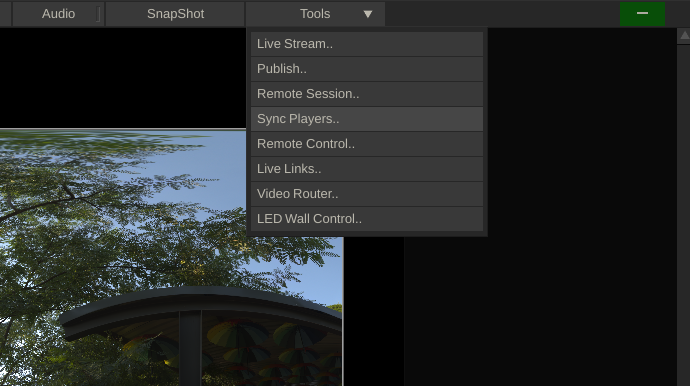

# Create and set up your Shot

In the Construct, Click on Filler and Select Black.

<figure><figcaption></figcaption></figure>

<figure><figcaption></figcaption></figure>

Drop the Black Frame on the Timeline.

### Import Media

Select Import Clips and import whatever media you will be using in your shot, then arrange it so that all the media is above the Black frame, as a "Version".

<figure><figcaption></figcaption></figure>

### Re-name the Clip

Click on the bottom of the Black frame, where it says "Black", here you can re-name your shot.&#x20;

<figure><figcaption></figcaption></figure>

Now double-click on the Black frame to enter the shot.&#x20;

### Check the Color Space and EOTF

Go to the Media tab and make sure that the settings are Rec2020, Gamma 2.4

<figure><figcaption></figcaption></figure>

### Change the shot length

Go to the Live FX Menu, change the Shot Length Out to match your media or however long you want it to be. You can also change the In if you want to start later in your shot. You can change this later if you are not sure yet.

<figure><figcaption></figcaption></figure>

### Bring in your media

On the right side, under the Versions tab, click on one of your video files and drag it into the viewport.&#x20;

<figure><figcaption></figcaption></figure>

### Scale and re-position your clip

If you want to scale your video, you can hold down Shift and grab the orange frame then drag right or left to scale up or down. Click and drag to move the video wherever you want it.

<figure><figcaption></figcaption></figure>

### Covert the video to Rec2020

On the right side menu, click on the Node Tree Tab.&#x20;

Select the bottom node, which is the source node of the video clip you imported.&#x20;

Click the button that says "Nest"

<figure><figcaption></figcaption></figure>

Now select the nest node, which is right above the source node and it has an icon of a square with an arrow that points to the right.

Go to the Media menu, change the Color to Rec2020, Gamma 2.4, and press the Apply button. The apply button will have an orange indicator to let you know it is active.

<figure><figcaption></figcaption></figure>

To get back to your main shot, click on the top node from the Node Tree menu.&#x20;

<figure><figcaption></figcaption></figure>

I repeat the steps for two more videos, and this is what the node tree looks like afterward.

<figure><figcaption></figcaption></figure>

### Add a Light Card

To add a light card, go to the Live FX menu, click Add Component, and select Light Card.

<figure><figcaption></figcaption></figure>

