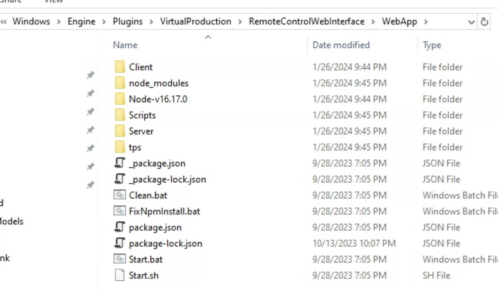

# How to Package an Unreal Engine Project for Live FX

## Package Project

Packaging a project is the same thing as building a game.&#x20;


The first time you package your project, it has to cook everything and it usually takes a long time, but after the first successful build, it usually takes a fraction of the time. For example, it might take 30 minutes to build the first time, and 2 minutes to build the second time.



Some errors you get may be due to plugins that are enabled and do not need to be packaged. For example, I had Nvidia's OptiX denoiser and I got an error that stated&#x20;


To package your project, go to **`Platforms>Windows>Package Project.`**

Navigate to a folder where you want it to go and press accept.

<figure><figcaption></figcaption></figure>

## Copy Webapp into Packaged Project

For web remote to work correctly, you need to copy over a specific folder and create a specific folder structure in the built folder.&#x20;

1. **Copy** the folder **Webapp** from your Unreal Engine folder, normally located in:\
   C:\Program Files\Epic Games\UE\_5.3\Engine\Plugins\VirtualProduction\RemoteControlWebInterface\WebApp
2. Navigate to the built folder, go into Windows\Engine\Plugins\
   By default, there is only a folder called Runtime in there.&#x20;
3. Create a new folder here called "**VirtualProduction"**\
   **\*Make sure to spell it exactly like VirtualProduction with caps and no space in between.**
4. Inside VirtualProduction, create another folder called "**RemoteControlWebInterface**"\
   **\*Make sure to spell it exactly like RemoteControlWebInterface with caps and no spaces in between.**
5. **Paste** the **WebApp** folder here.&#x20;
6. Check and make sure your paths and folders look correct, if done correctly it should look like this:

<figure><figcaption></figcaption></figure>

## Change Project Name

To change the project name (what shows up when you open the Task Manager), you can go to the DefaultGame.ini file and rename the "ProjectName" to what you want.

<figure><figcaption></figcaption></figure>
